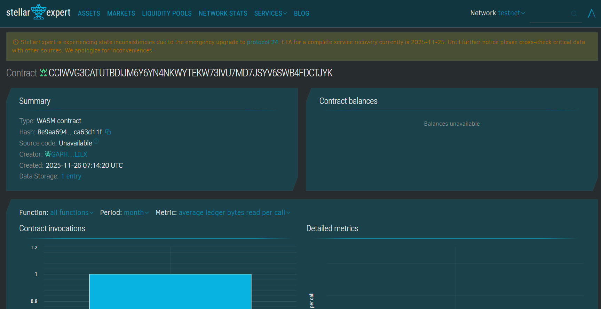

# InvestorClub Chain

## Project Title

**InvestorClub Chain**

## Project Description

InvestorClub Chain is a decentralized community investment pool built on the Stellar blockchain using Soroban smart contracts. It enables transparent, token-managed collective investment with democratic governance. Community members can pool their resources, propose investment opportunities, vote on proposals based on their stake, and collectively manage fund allocation through a fully transparent on-chain governance system.

## Project Vision

Our vision is to democratize investment opportunities by creating a trustless, transparent platform where communities can collectively invest and make decisions without intermediaries. We aim to:

- **Empower Communities**: Enable groups to pool resources and invest collectively in opportunities that might be out of reach individually
- **Ensure Transparency**: All investments, proposals, and votes are recorded on-chain, providing complete transparency
- **Democratic Governance**: Implement fair voting mechanisms where voting power is proportional to investment stake
- **Reduce Barriers**: Lower the entry barriers to quality investment opportunities through collective participation
- **Build Trust**: Eliminate the need for centralized fund managers through smart contract automation

## Key Features

### 1. **Token-Based Investment Pool**

- Community members can invest tokens to join the pool
- Automatic tracking of total pool value and number of investors
- Transparent record of all investments on the blockchain

### 2. **Proportional Voting Power**

- Voting power is automatically calculated based on investment amount
- Fair representation: 1 vote per 100 tokens invested
- All investors have a voice in the community's decisions

### 3. **Proposal Creation System**

- Any investor can create investment proposals
- Proposals include title, description, and requested amount
- Timestamps track when proposals are created

### 4. **Democratic Voting Mechanism**

- Investors vote "for" or "against" proposals
- Votes are weighted by voting power
- Real-time tracking of votes for and against each proposal

### 5. **Transparent Proposal Execution**

- Proposals are executed only when they receive majority approval
- Smart contract verifies sufficient pool funds before execution
- Automatic tracking of executed vs. active proposals

### 6. **Comprehensive Data Views**

- **Pool Status**: View total invested amount, investor count, and proposal statistics
- **Investor Profile**: Check individual investment amounts, voting power, and join date
- **Proposal Details**: Access complete proposal information including vote counts and execution status

### 7. **Security Features**

- Address authentication for all transactions
- Validation checks for all operations
- Prevention of duplicate voting and unauthorized access

## Contract Details: 
- Contract Address: CDYARKHEJ5U6OYFSNYYOT36EVQ5BWS3FZTZ4FYAV4IECKMPUW3OVJUKF


## Future Scope

### Short-term Enhancements (3-6 months)

1. **Withdrawal Mechanism**: Allow investors to withdraw their funds with appropriate penalties/timeframes
2. **Proposal Time Limits**: Add expiration dates for proposals to keep governance active
3. **Minimum Investment Threshold**: Set minimum investment requirements for proposal creation
4. **Vote Delegation**: Enable investors to delegate their voting power to trusted representatives

### Medium-term Development (6-12 months)

1. **Multi-Signature Execution**: Require multiple authorized signatures for large proposal executions
2. **Investment Categories**: Organize proposals into categories (DeFi, Real Estate, Startups, etc.)
3. **Reputation System**: Track investor participation and successful proposal outcomes
4. **Dividend Distribution**: Implement profit-sharing mechanisms for successful investments
5. **Emergency Pause**: Add circuit breaker functionality for security incidents

### Long-term Vision (12+ months)

1. **Cross-Chain Integration**: Enable investment pools across multiple blockchain networks
2. **AI-Powered Analytics**: Integrate machine learning for proposal success prediction
3. **Fractional NFT Investments**: Allow investment in tokenized real-world assets
4. **DAO Framework**: Evolve into a full Decentralized Autonomous Organization with advanced governance
5. **Professional Fund Manager Integration**: Option to hire on-chain fund managers with performance-based compensation
6. **Insurance Pool**: Create a reserve fund to protect against failed investments
7. **Mobile App**: Develop user-friendly mobile applications for iOS and Android
8. **Audit & Compliance**: Regular third-party smart contract audits and regulatory compliance features

## Technical Architecture

### Smart Contract Functions

#### Core Functions

- `invest()`: Join the pool by investing tokens
- `create_proposal()`: Submit new investment proposals
- `vote_on_proposal()`: Cast votes on active proposals
- `execute_proposal()`: Execute approved proposals

#### View Functions

- `view_pool_status()`: Get overall pool statistics
- `view_investor()`: Check investor details
- `view_proposal()`: View proposal information

### Data Structures

- **PoolStatus**: Tracks total invested amount, investor count, and proposal metrics
- **Proposal**: Stores proposal details, voting results, and execution status
- **Investor**: Maintains individual investor data and voting power

## Getting Started

### Prerequisites

- Rust toolchain
- Soroban CLI
- Stellar account with testnet tokens

### Installation

```bash
# Clone the repository
git clone https://github.com/yourusername/investorclub-chain.git

# Navigate to project directory
cd investorclub-chain

# Build the contract
soroban contract build

# Deploy to testnet
soroban contract deploy \
  --wasm target/wasm32-unknown-unknown/release/investorclub_chain.wasm \
  --network testnet
```

## Contributing

We welcome contributions from the community! Please read our contributing guidelines and submit pull requests for any enhancements.

## License

This project is licensed under the MIT License - see the LICENSE file for details.

## Contact

For questions, suggestions, or partnership opportunities, please reach out to:

- Email: contact@investorclub.chain
- Discord: [Join our community]
- Twitter: @InvestorClubChain

---

**Disclaimer**: This smart contract is provided as-is for educational and development purposes. Always conduct thorough testing and audits before deploying to mainnet with real funds.
